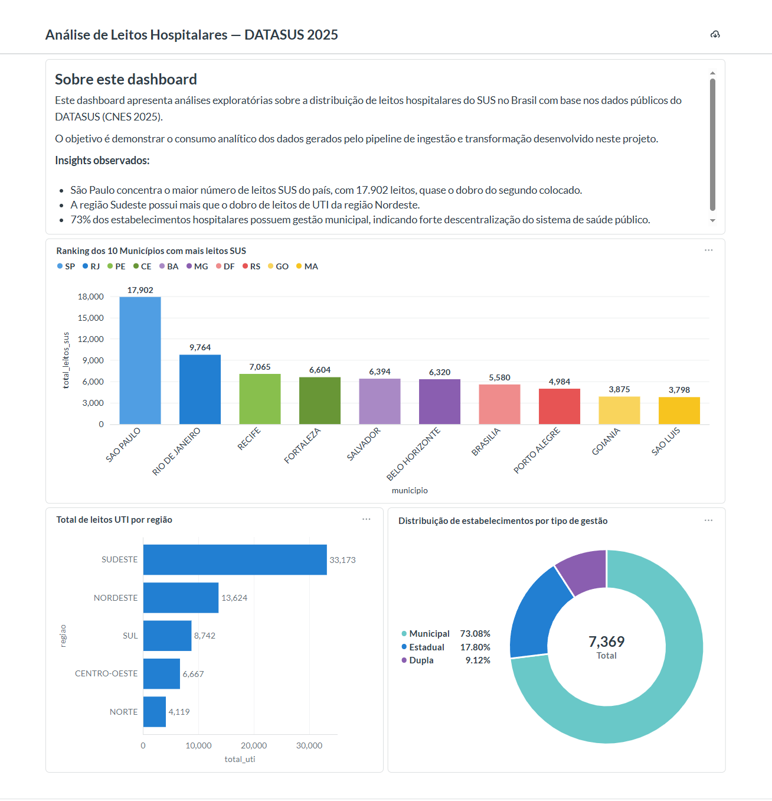

# Pipeline de Dados de Leitos Hospitalares — DATASUS

Este repositório documenta a construção de um pipeline de dados focado
no setor de saúde pública brasileira. O objetivo é transformar dados
brutos do DATASUS em informação estruturada e analítica por meio de boas
práticas de engenharia de dados.

---

## Problema de Negócio

Os dados públicos do DATASUS são disponibilizados em formato bruto (CSV),
o que dificulta análises comparativas, padronização de métricas e decisões
estratégicas.

Este projeto organiza e modela esses dados para permitir:

- Análise da distribuição de leitos hospitalares por UF e região
- Comparação entre leitos totais e leitos SUS
- Ranking de municípios por capacidade de UTI
- Consolidação de métricas analíticas reutilizáveis

---

## Sobre o Dataset

Fonte: DATASUS — Cadastro Nacional de Estabelecimentos de Saúde (CNES)
Período: 2025
Registros: 86.147 linhas brutas → 7.369 estabelecimentos únicos após deduplicação

Campos utilizados:
- `cnes` — código único do estabelecimento
- `co_ibge` — código do município
- `co_tipo_unidade` — tipo de unidade de saúde
- `leitos_existentes` — total de leitos do estabelecimento
- `leitos_sus` — leitos disponíveis para o SUS
- `uti_total` — leitos de UTI
- `tp_gestao` — tipo de gestão (Municipal, Estadual, Dupla)

---

## Arquitetura e Estratégia

O projeto adota a filosofia **ELT (Extract, Load, Transform)**,
priorizando a ingestão bruta (RAW) para garantir rastreabilidade e
integridade dos dados antes da modelagem analítica. A ingestão utiliza
estratégia **replace** na camada Bronze — garantindo que a `raw_leitos`
sempre reflita o estado atual da fonte com todas as colunas originais do CSV.

### Fluxo de Dados
```
DATASUS (CNES)
      ↓
Python ingestion
      ↓
Bronze — raw_leitos (dados originais)
      ↓
Silver — leitos + municipios + tipos_unidade
      ↓
Gold — queries analíticas
      ↓
Metabase Dashboard
```

### Camadas do Projeto

- **Bronze** → `raw_leitos` (dados originais, sem transformação)
- **Silver** → Modelo dimensional normalizado (`leitos`, `municipios`, `tipos_unidade`)
- **Gold** → Queries analíticas com JOIN, agregações e window functions

---

## Modelo Dimensional

A tabela `raw_leitos` foi normalizada em um modelo relacional com três tabelas:
```
municipios (co_ibge PK, municipio, uf, regiao)
        │
        └──── leitos (cnes PK, nome_estabelecimento, co_ibge FK, co_tipo_unidade FK,
                      leitos_existentes, leitos_sus, uti_total, tp_gestao)
                                │
tipos_unidade (co_tipo_unidade PK, ds_tipo_unidade)
```

**Decisões de engenharia:**
- `DISTINCT` nos INSERTs das dimensões para garantir unicidade
- `GROUP BY cnes` com `MAX`/`SUM` na fato para deduplicar registros da base pública
- Chaves estrangeiras para garantir integridade referencial
- Resultado: 7.369 estabelecimentos únicos sem duplicidade

---

## Dashboard Analítico



---

## Estrutura do Repositório
```
.
├── data/
│   └── raw/                         # CSV bruto (não versionado)
├── infra/
│   ├── docker-compose.yml
│   └── .env.example
├── src/
│   ├── ingestion/
│   │   ├── etl/ingest_sus.py        # Carga RAW para PostgreSQL
│   │   └── sql/
│   │       ├── 01_bronze_exploratory_queries.sql
│   │       └── 02_bronze_analytical_queries.sql
│   ├── transformation/
│   │   └── sql/
│   │       ├── 01_create_dimensional_model.sql
│   │       └── 03_scd_type2_municipios.sql
│   └── analytics/
│       └── sql/
│           └── 02_analytical_queries.sql
├── docs/
│   └── images/
│       └── dashboard.png
└── README.md
```

---

## Tecnologias e Infraestrutura

- **Linguagem:** Python
- **Bibliotecas:** Pandas, SQLAlchemy, python-dotenv, logging
- **Banco de Dados:** PostgreSQL 17
- **Interface:** pgAdmin 4 / DBeaver
- **Orquestração:** Docker Compose
- **Persistência:** Volumes Docker
- **Versionamento:** Git e GitHub
- **Visualização:** Metabase

---

## Como Executar o Ambiente

### 1. Configuração de Variáveis de Ambiente

- Renomeie `infra/.env.example` para `infra/.env`
- Ajuste as credenciais conforme necessário

### 2. Pré-requisitos

- Docker Desktop instalado e rodando
- Git
- Python 3.10+

### 3. Subindo a Infraestrutura
```bash
cd infra
docker-compose up -d
```

### 4. Executando a Ingestão
```bash
cd src/ingestion/etl
python ingest_sus.py
```

### 5. Acesso aos Serviços

- pgAdmin → http://localhost:8080
- PostgreSQL → Porta 5432
- Metabase → http://localhost:3000

---

## Validação
```sql
-- Verifica total de registros ingeridos
SELECT COUNT(*) FROM raw_leitos;

-- Verifica integridade da fato (deve retornar vazio)
SELECT cnes, COUNT(*)
FROM leitos
GROUP BY cnes
HAVING COUNT(*) > 1;
```

---

## Roadmap de Desenvolvimento

### Fase 1 — Infraestrutura (Concluído)
- Estruturação do repositório
- Docker Compose com persistência via volumes
- Ambiente virtual isolado

### Fase 2 — Ingestão e Modelagem (Concluído)
- Script `ingest_sus.py` com Pandas + SQLAlchemy
- Carga de 86.147 registros para PostgreSQL
- Normalização em modelo dimensional (leitos, municipios, tipos_unidade)
- Deduplicação e integridade referencial
- Queries analíticas com JOIN, GROUP BY e Window Functions
- Logging persistente para rastreabilidade
- Ingestão idempotente com deduplicação por CNES
- Análise de performance com EXPLAIN ANALYZE e índices
- Implementação de SCD Tipo 2 com documentação de limitação de surrogate key
- Validação de cardinalidade para decisão de índices
- Dashboard analítico com Metabase (ranking, distribuição regional e por tipo de gestão)

### Fase 3 — Qualidade e CI/CD (Concluído)
- Integração de SQLFluff
- Automação com GitHub Actions

### Fase 4 — Cloud e dbt (Planejado)
- Migração para AWS S3 + BigQuery
- Modelagem com dbt
- Dashboard no Looker Studio

---

## Licença

Este projeto está sob a licença MIT.